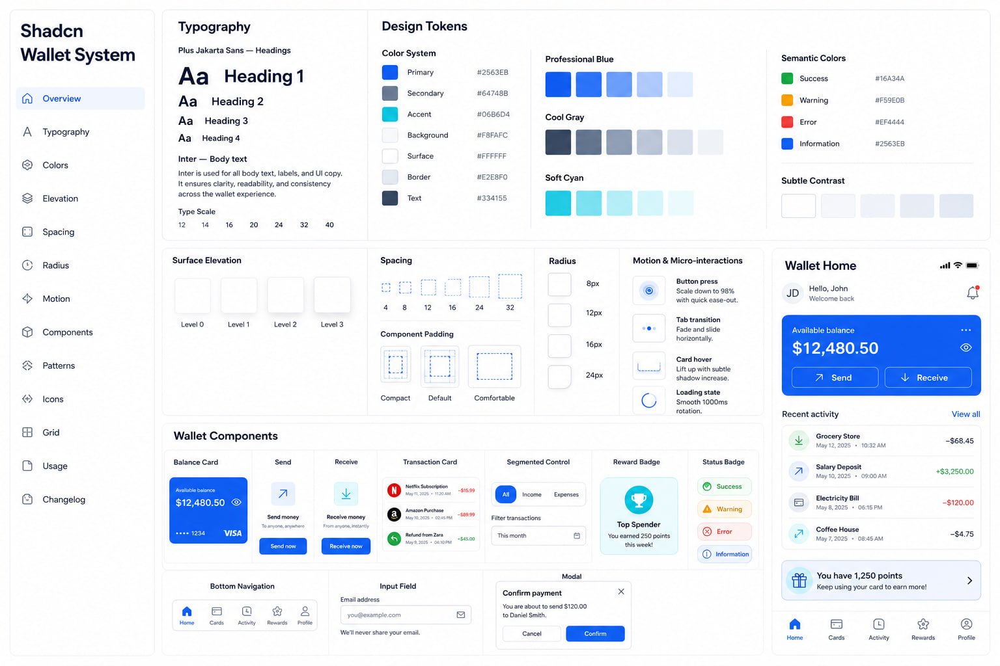
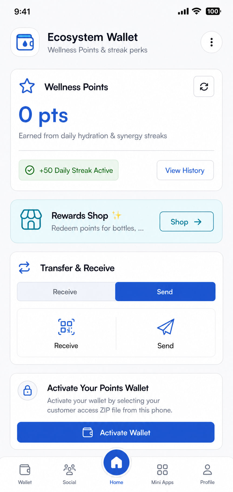
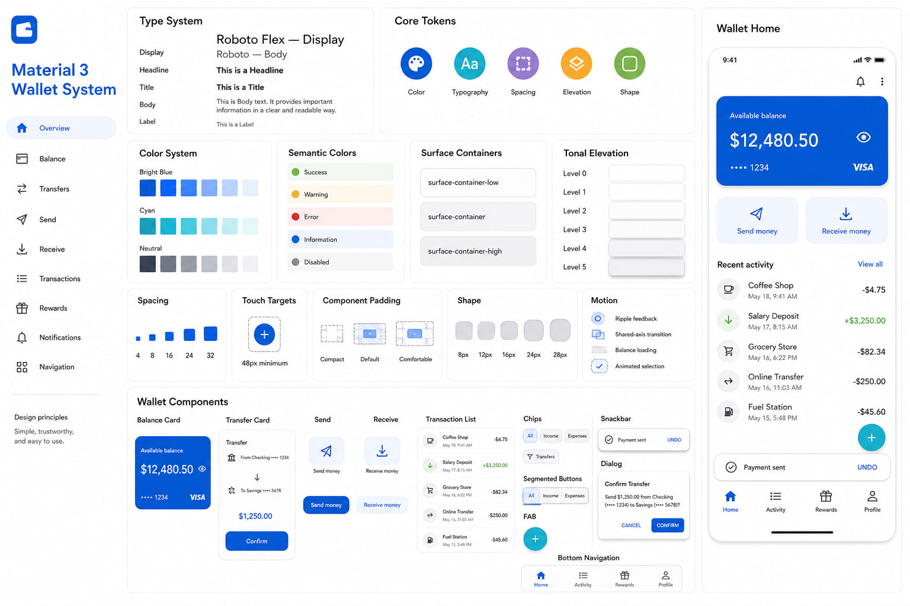
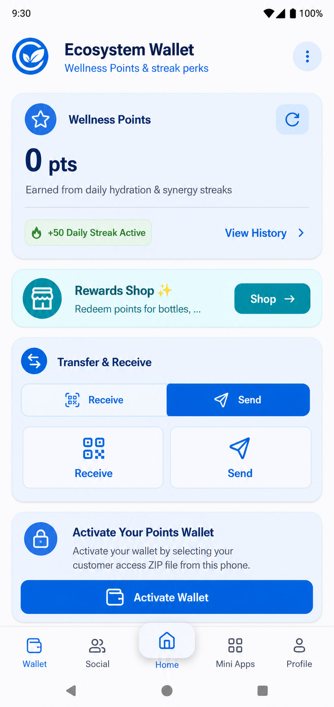
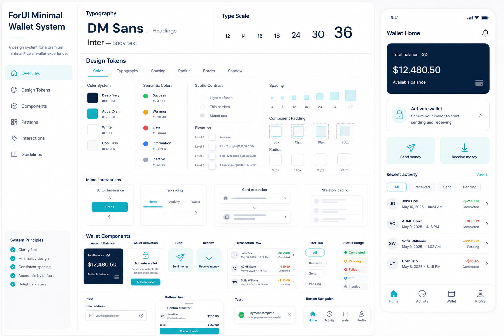
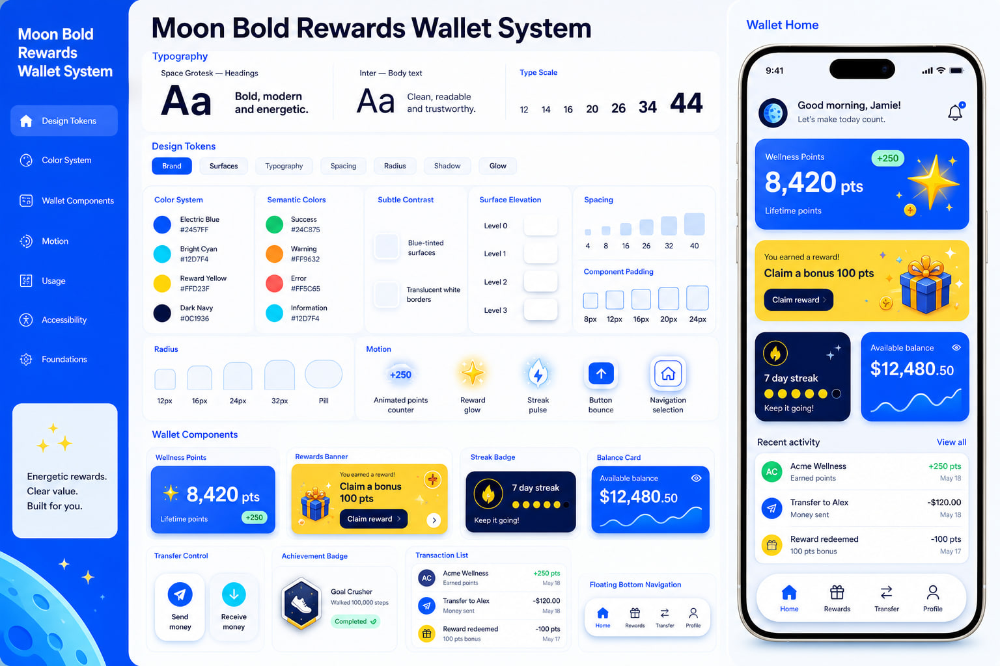
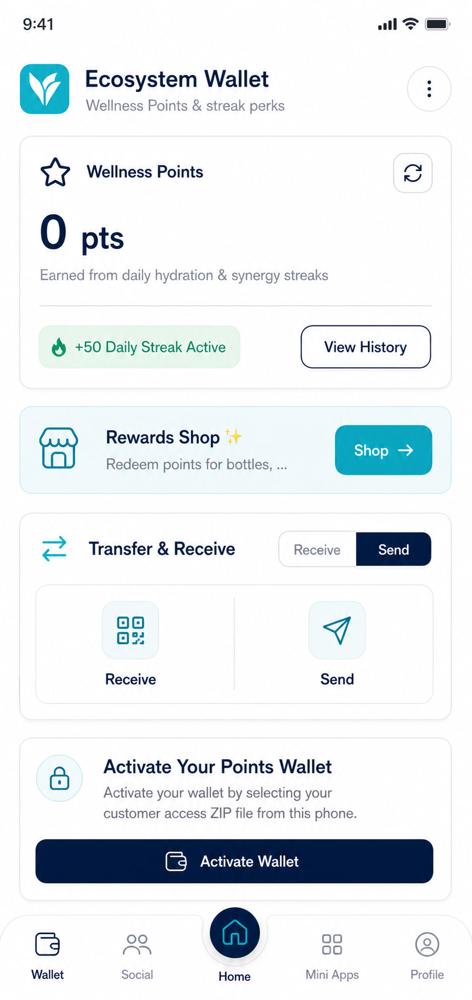
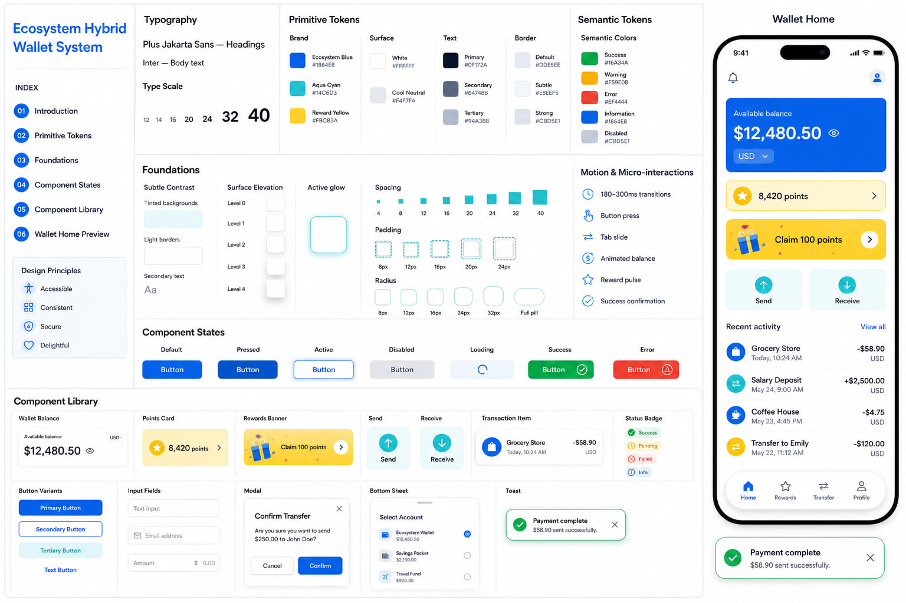
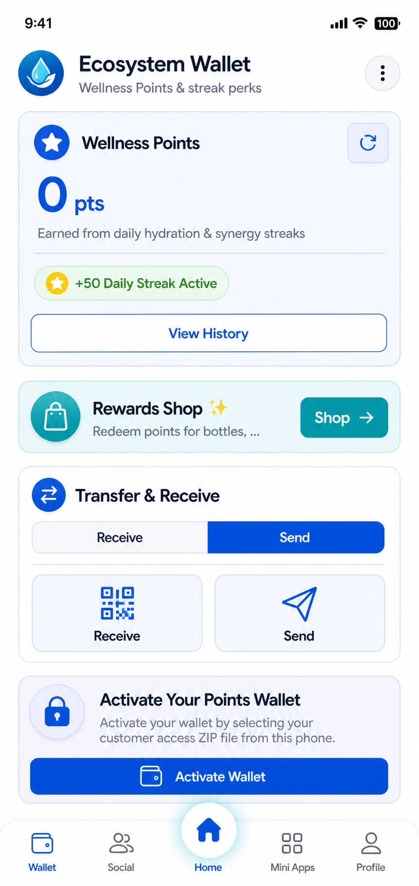

# Wallet System Design Options

This document presents five possible design-system directions for the wallet. Each option includes typography, colors, design tokens, semantic colors, contrast, elevation, spacing, border radius, motion, and reusable wallet components.

## Option 1 — shadcn Wallet Design System

### Design Direction

The shadcn Wallet Design System uses a clean, simple, and professional interface. It focuses on clarity, accessibility, subtle contrast, and consistent reusable components. This style makes wallet information easy to understand without making the screen look crowded.

### Design Specifications

- **Font Pairing:** Plus Jakarta Sans for headings and Inter for body text
- **Type Scale:** 12px, 14px, 16px, 20px, 24px, 32px, and 40px
- **Primary Color:** Professional Blue
- **Supporting Colors:** Soft Cyan, White, and Cool Gray
- **Semantic Colors:**
  - Success: Green
  - Warning: Amber
  - Error: Red
  - Information: Blue
- **Subtle Contrast:** Tinted backgrounds, muted text, and light borders
- **Surface Elevation:** Levels 0–3 using borders and soft shadows
- **Spacing Scale:** 4px, 8px, 12px, 16px, 24px, and 32px
- **Component Padding:** Compact, Default, and Comfortable
- **Border Radius:** 8px, 12px, 16px, and 24px
- **Motion:** 150–250ms smooth transitions
- **Micro-interactions:** Button press, tab transition, loading state, and card feedback

### Wallet Component Library

- Wallet balance card
- Send and receive buttons
- Transaction card
- Segmented control
- Reward badge
- Status badge
- Input fields
- Modal and bottom sheet
- Bottom navigation bar

### Option 1 Design Photo

---

## Option 2 — Material 3 Wallet Design System

### Design Direction

The Material 3 Wallet Design System provides a modern and interactive mobile experience. It uses tonal surfaces, clear touch targets, expressive shapes, and familiar Android interaction patterns. It is suitable for wallets developed with Flutter or designed for Android devices.

### Design Specifications

- **Font Pairing:** Roboto Flex for display text and Roboto for body text
- **Type Scale:** Material 3 Display, Headline, Title, Body, and Label
- **Primary Color:** Bright Blue
- **Supporting Colors:** Cyan and Neutral Tonal Colors
- **Semantic Colors:**
  - Success: Green
  - Warning: Orange
  - Error: Red
  - Information: Blue
  - Disabled: Gray
- **Subtle Contrast:** Surface Container Low, Surface Container, and Surface Container High
- **Surface Elevation:** Tonal elevation levels 0–5
- **Spacing Scale:** 4px, 8px, 12px, 16px, 24px, and 32px
- **Touch Target:** Minimum 48px
- **Border Radius:** 8px, 12px, 16px, 24px, and 28px
- **Motion:** Material easing and spring transitions
- **Micro-interactions:** Ripple feedback, animated selection, balance loading, and page transitions

### Wallet Component Library

- Tonal balance card
- Send and receive action buttons
- Transaction list
- Filter chips
- Segmented buttons
- Floating action button
- Snackbar
- Confirmation dialog
- Material bottom navigation bar

### Option 2 Design Photo

---

## Option 3 — ForUI Minimal Wallet Design System

### Design Direction

The ForUI Minimal Wallet Design System provides a calm, lightweight, and premium appearance. It uses generous white space, precise alignment, soft surfaces, and limited color accents. The result is a wallet interface that feels simple and easy to use.

### Design Specifications

- **Font Pairing:** DM Sans for headings and Inter for body text
- **Type Scale:** 12px, 14px, 16px, 18px, 24px, 30px, and 36px
- **Primary Color:** Deep Navy Blue
- **Supporting Colors:** Aqua Cyan, White, and Cool Gray
- **Semantic Colors:**
  - Success: Green
  - Warning: Amber
  - Error: Red
  - Information: Blue
  - Inactive: Gray
- **Subtle Contrast:** Thin borders, muted text, and light-gray surfaces
- **Surface Elevation:** Levels 0–3 using very soft shadows
- **Spacing Scale:** 4px, 8px, 12px, 16px, 20px, 24px, and 32px
- **Component Padding:** 8px, 12px, 16px, and 20px
- **Border Radius:** 10px, 14px, 18px, and 24px
- **Motion:** 180–220ms subtle transitions
- **Micro-interactions:** Button compression, sliding tabs, card expansion, and skeleton loading

### Wallet Component Library

- Account balance card
- Wallet activation card
- Send and receive control
- Transaction row
- Filter tabs
- Status badge
- Form inputs
- Bottom sheet
- Toast notification
- Minimal bottom navigation bar

### Option 3 Design Photo

---

## Option 4 — Moon Bold Rewards Wallet Design System

### Design Direction

The Moon Bold Rewards Wallet Design System is energetic, colorful, and focused on gamification. It highlights wallet points, rewards, achievements, and streaks through bold colors, rounded cards, and animated feedback.

### Design Specifications

- **Font Pairing:** Space Grotesk for headings and Inter for body text
- **Type Scale:** 12px, 14px, 16px, 20px, 26px, 34px, and 44px
- **Primary Color:** Electric Blue
- **Supporting Colors:** Bright Cyan, Reward Yellow, White, and Dark Navy
- **Semantic Colors:**
  - Success: Green
  - Warning: Orange
  - Error: Coral Red
  - Information: Cyan
- **Subtle Contrast:** Blue-tinted surfaces and translucent white borders
- **Surface Elevation:** Layered shadows with a soft blue glow
- **Spacing Scale:** 4px, 8px, 12px, 16px, 24px, 32px, and 40px
- **Component Padding:** 8px, 12px, 16px, 20px, and 24px
- **Border Radius:** 12px, 16px, 24px, 32px, and Full Pill
- **Motion:** 200–300ms expressive transitions
- **Micro-interactions:** Points counter, reward glow, streak pulse, button bounce, and navigation animation

### Wallet Component Library

- Wellness points card
- Rewards shop banner
- Streak badge
- Achievement badge
- Wallet balance card
- Send and receive control
- Reward progress indicator
- Transaction list
- Animated action buttons
- Floating bottom navigation bar

### Option 4 Design Photo

---

## Option 5 — Hybrid Wallet Design System

### Design Direction

The Hybrid Wallet Design System combines the clean structure of shadcn/ui, the mobile usability of ForUI, and the energetic reward style of Moon Design. It balances trustworthy wallet functions with engaging points, rewards, and streak features.

### Design Specifications

- **Font Pairing:** Plus Jakarta Sans for headings and Inter for body text
- **Type Scale:** 12px, 14px, 16px, 20px, 24px, 32px, and 40px
- **Primary Color:** Ecosystem Blue
- **Supporting Colors:** Aqua Cyan, Reward Yellow, White, and Cool Gray
- **Semantic Colors:**
  - Success: Green
  - Warning: Amber
  - Error: Red
  - Information: Blue
  - Disabled: Gray
- **Subtle Contrast:** Tinted backgrounds, light borders, and secondary text
- **Surface Elevation:** Levels 0–4 using borders, soft shadows, and active glow
- **Spacing Scale:** 4px, 8px, 12px, 16px, 20px, 24px, 32px, and 40px
- **Component Padding:** 8px, 12px, 16px, 20px, and 24px
- **Border Radius:** 8px, 12px, 16px, 24px, 32px, and Full Pill
- **Motion:** 180–300ms based on interaction importance
- **Micro-interactions:** Button feedback, tab slide, animated balance, reward pulse, and success confirmation

### Wallet Component Library

- Wallet balance card
- Wallet activation card
- Points card
- Rewards banner
- Send and receive control
- Transaction item
- Status and achievement badges
- Button variants
- Input fields
- Modal and bottom sheet
- Toast notification
- Floating bottom navigation bar

### Component States

- Default
- Pressed
- Active
- Disabled
- Loading
- Success
- Error

### Option 5 Design Photo

---

